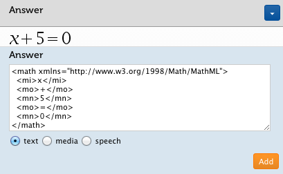

% Consejos para crear archivos EPUB 3 accesibles
% María Emilia Bonfim 
% Marzo 2024

# Introducción: Publicación de contenidos accesibles

## Accesibilidad EPUB

\centering

##  El cambio del ePUB

* En 2017, la fusión del **IDPF** con el **W3C** marcó un cambio en la publicación digital: combina lo mejor de los libros empaquetados (EPUB) con la flexibilidad de la web.

* Aprenderá a crear EPUB accesible desde su concepción, cómo adaptar sus contenidos a formatos accesibles, técnicas y herramientas para hacer que los EPUB sean accesibles.

## Accesibilidad de los ePUB

* La accesibilidad se ocupa de tres cuestiones: 
	1. cómo las personas con discapacidad acceden a la información electrónica; 
	2. cómo diseñadores y desarrolladores de contenidos se aseguran de que los sitios web, las publicaciones y otros tipos de contenidos digitales funcionen correctamente en dispositivos y servicios de asistencia; 
	3. y cómo puede lograrse que los contenidos y la digitalización sean accesibles desde su concepción.

# Sección 1: Estructura

## Todo el texto debe estar disponible en un orden de lectura lógico.
* El texto **NO** debe presentarse como:
	- imágenes
	- reordenarse mediante CSS 
	- requerir secuencias de comandos para acceder

* Utilice marcas estructurales para definir el orden de lectura natural principal y para distinguir material secundario como:

	- Notas a pie de página
	- Referencias
	- Figuras
	- Otros contenidos auxiliares.

## Presentación y contenido separados

* La lectura visual es sólo una forma de acceder al contenido. No utilice señales únicamente visuales, como texto en color como única pista sobre el significado o importancia de una palabra o sección.

* No utilice tablas o imágenes de texto para controlar la apariencia del contenido. **El significado del contenido debe ser el mismo *con* y *sin* ningún estilo o formato aplicado.**

## Proporcionar navegación completa

* Incluya una tabla de contenido completa en la portada y considere tablas de contenido más pequeñas al comienzo de cada sección. 

* Utilice las etiquetas `<section>` y `<aside>` en el contenido y la etiqueta `<itemref linear=”no”>` para definir un orden de lectura lógico.

* En esta [web de W3schools](https://www.w3schools.com/html/default.asp) puedes saber más sobre las etiquetas mencionadas. 

## Crear una estructura significativa

* Si es posible, cree una estructura utilizando encabezados numerados en una estructura lógica. 

* Para otras estructuras etiquetadas, especifique su contenido con el atributo epub:type.

	1. Por ejemplo, la etiqueta que contiene el prefacio de un libro podría verse como `<section epub:type=”preface”>`. 

* Las etiquetas específicas son solo para contenido específico (ej. la etiqueta `<cite>` es **solo** para citas). Usarse de acuerdo con el estándar. 

* Utilice la etiqueta más específica disponible y no incluya automáticamente etiquetas `
` o `` alrededor de todo.

##  Definir el contenido de cada etiqueta.

* Incluya información semántica para describir el contenido de una etiqueta.

* Utilice el Vocabulario de semántica estructural EPUB 3 tal como se define [en este enlace sobre la estructura](http://idpf.org/epub/vocab/structure/) para identificar el contenido.

# Sección 2: Contenido

##  Utilice imágenes solo para fotografías, **no** para tablas o texto.

* Si se requiere una tabla o imagen para la comprensión del documento, utilice un marcado adecuado para el texto y los datos tabulares. 

* Si las imágenes de texto son inevitables, proporcione una descripción y transcripción del texto (SVG accesible). 
	- Los gráficos SVG accesibles permiten que el texto de las imágenes se represente de forma accesible. 

* También pueden hacer posible entregar imágenes táctiles electrónicamente a usuarios ciegos con dispositivos apropiados o ayudar a automatizar la creación de imágenes táctiles.

##  Utilice descripciones de imágenes y texto alternativo. 

* Cada imagen debe tener (a menos que sea únicamente decorativa):

	- Descripción
	- Título
	- Texto alternativo 

* Consulte las Pautas de imágenes de DIAGRAM Center para EPUB 3 para conocer las mejores prácticas de marcado.

##  Incluir números de página 

* Son la forma en que muchas personas navegan por un libro. 

* Para cualquier libro con un equivalente impreso, utilice el atributo `epub:type=”pagebreak”` para designar los números de página. 

* Incluya el ISBN de la fuente de los números de página en los metadatos del paquete del libro.

## Definir el idioma(s)

* Para asegurarse de que cada palabra se represente correctamente, especifique el idioma predeterminado del contenido en la etiqueta **html raíz**. 

* Indique cualquier palabra, frase o pasaje en un idioma diferente utilizando el atributo `xml:lang:` `rue Saint-Andre-des-Arts`.

## Utilice MatemáticasML

* MathML hace que las ecuaciones matemáticas sean accesibles para todos al eliminar la ambigüedad de una descripción verbal de una imagen.

## Proporcionar acceso alternativo al contenido multimedia.

* Asegúrese de que los controles nativos para contenido de video y audio estén habilitados de forma predeterminada. 

* Proporcione opciones alternativas, como subtítulos o descripciones para videos y transcripciones para audio.

## Hacer accesible el contenido interactivo 

* El contenido interactivo que utiliza JavaScript o SVG debe ser accesible. 

* Todos los controles personalizados deben implementar completamente las funciones, estados y propiedades de ARIA, según corresponda.

## Utilice metadatos de accesibilidad

* Una buena práctica general son los metadatos de accesibilidad para que los usuarios finales sepan qué funciones existen y para que los motores de búsqueda puedan descubrir sus materiales accesibles.

## Otras técnicas rápidas de accesibilidad en EPUB

* Use la maquetación fluida para lograr la máxima compatibilidad con los lectores de pantalla, lentes de aumento y navegación. 

* Incluya, siempre que sea posible, un video en lengua de señas (sincronizado o incrustado).
